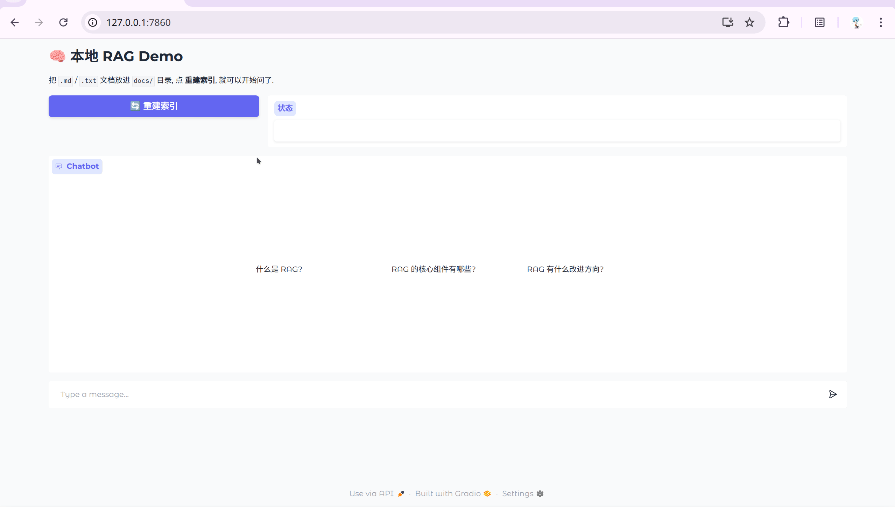

# 🧠 RAG Demo




一个极简但完整的本地 **RAG (检索增强生成)** 演示项目. 100% 在本地运行, 不依赖任何云端 API.

核心代码只有一个 200 行的文件 ([`src/rag.py`](src/rag.py)), 覆盖 RAG 的完整流程: 加载 → 切分 → 向量化 → 入库 → 检索 → 生成.

## ✨ 特性
- 🏠 **全本地**: LLM / embedding / 向量库都跑在本机, 不用 API Key
- 🇨🇳 **中文友好**: 默认使用 BGE 中文 embedding + Qwen2.5
- 📦 **依赖极少**: 只需 4 个 Python 包
- 🔧 **可读性优先**: 核心逻辑集中在一个文件, 方便改造学习

## 🧱 技术栈

| 组件 | 选型 | 说明 |
|---|---|---|
| LLM | [Ollama](https://ollama.com) + `qwen2.5:3b` | 3B 参数, 量化后约 2GB 显存 |
| Embedding | `BAAI/bge-small-zh-v1.5` | 中文效果好, 约 100MB, CPU 也能跑 |
| 向量库 | [ChromaDB](https://www.trychroma.com) | 文件型, 零配置 |
| UI | [Gradio](https://www.gradio.app) | 一行代码出 Web 界面 |

## 🚀 快速开始

### 1. 安装 Ollama 并拉模型
```bash
curl -fsSL https://ollama.com/install.sh | sh
ollama pull qwen2.5:3b
```
验证一下: `ollama run qwen2.5:3b "你好"`, 能回答就 OK.

### 2. 创建 Python 环境

需要先装 [Miniconda](https://docs.conda.io/projects/miniconda/) 或 Anaconda.

```bash
conda create -n rag python=3.11 -y
conda activate rag

# PyTorch GPU 版 (用 pip 装, 比 conda channel 更稳定)
pip install torch --index-url https://download.pytorch.org/whl/cu121

# 其他依赖
pip install -r requirements.txt
```

验证 GPU 是否可用:
```bash
python -c "import torch; print(torch.cuda.is_available(), torch.cuda.get_device_name(0) if torch.cuda.is_available() else '')"
```
看到 `True NVIDIA GeForce ...` 就说明 PyTorch 认到显卡了.

> 💡 **为什么 PyTorch 用 pip 而不是 conda**: `conda install pytorch` 会拉依赖 MKL, 但 conda-forge 和 pytorch channel 的 MKL 版本经常对不上, 导致 `undefined symbol: iJIT_NotifyEvent` 这类报错. pip 装的 wheel 是静态链接的, 不依赖 conda 的 MKL, 更稳. PyTorch 官方自 2.5 起也不再维护 conda channel, 推荐走 pip.

### 3. 放入你的文档
把任意 `.md` 或 `.txt` 文件丢进 `docs/` 目录. 仓库里自带了一个 `docs/rag-intro.md` 可以直接用.

### 4. 运行
```bash
# 方式一: 命令行
python cli.py index
python cli.py ask "什么是 RAG?"

# 方式二: Web 界面
python app.py
# 浏览器打开 http://127.0.0.1:7860
```

## 📁 项目结构

```
.
├── app.py              # Gradio Web 界面
├── cli.py              # 命令行入口
├── src/
│   ├── __init__.py
│   └── rag.py          # RAG 核心流程 (本项目的主角)
├── docs/               # 放你的知识文档
│   └── rag-intro.md    # 示例文档
├── data/               # 向量库持久化目录 (运行时自动生成, 已 gitignore)
├── requirements.txt
└── README.md
```

## 🔄 RAG 工作流程

```
用户问题
   │
   ▼
[1] 向量化 (bge-small-zh-v1.5)
   │
   ▼
[2] 在 Chroma 里查 top-k 相似片段
   │
   ▼
[3] 拼 prompt: "根据以下资料回答问题..."
   │
   ▼
[4] 交给本地 LLM (qwen2.5:3b via Ollama)
   │
   ▼
答案 + 引用来源
```

## ⚙️ 参数调整

所有可调参数在 `RAGPipeline.__init__` 里, 常用的几个:

| 参数 | 默认值 | 说明 |
|---|---|---|
| `chunk_size` | 500 | 每个 chunk 的字符数 |
| `chunk_overlap` | 50 | 相邻 chunk 的重叠字符数, 避免句子被切断 |
| `top_k` | 3 | 检索时返回几个最相似的 chunk |
| `llm_model` | `qwen2.5:3b` | 本地 Ollama 模型名, 可以换成 `qwen2.5:7b` 等 |
| `embedding_model` | `BAAI/bge-small-zh-v1.5` | HuggingFace 模型名 |

## 🔬 下一步可以做什么

这个 demo 刻意保持简单, 方便在上面做各种实验:

- [ ] 把切分器换成按段落 / 标题的语义切分 (如 `RecursiveCharacterTextSplitter`)
- [ ] 接入 PDF 加载 (`pypdf`, `unstructured`)
- [ ] 加一个 reranker (例如 `BAAI/bge-reranker-base`)
- [ ] 加入混合检索 (向量检索 + BM25)
- [ ] 把 LLM 换成更大的模型 (`qwen2.5:7b`)
- [ ] 加入多轮对话历史
- [ ] 加评估: 用 ragas 或自己写一个 faithfulness / recall 指标

## 🐛 常见问题

<details>
<summary><b>PyTorch 报 <code>undefined symbol: iJIT_NotifyEvent</code></b></summary>

conda 环境里 MKL 版本和 PyTorch 不匹配. 两种解法:

```bash
# 解法 1: 降 mkl
conda install "mkl<2024.1" -y

# 解法 2 (推荐): 卸载 conda 装的 torch, 改用 pip 装
conda remove pytorch pytorch-cuda -y
pip install torch --index-url https://download.pytorch.org/whl/cu121
```

</details>

<details>
<summary><b>HuggingFace 模型下载超时</b></summary>

设置国内镜像后重跑:

```bash
export HF_ENDPOINT=https://hf-mirror.com
python cli.py index
```

</details>

<details>
<summary><b>Gradio 版本差异导致报错</b></summary>

本项目在 Gradio 5.x / 6.x 上测试过. 如果装到不同大版本出现 API 不兼容:

```bash
# 完全按 lock 文件的版本装
pip install -r requirements-lock.txt
```

</details>

<details>
<summary><b>Ollama 找不到模型</b></summary>

确认 Ollama 服务在跑, 模型已拉取:

```bash
systemctl status ollama   # 应该是 active (running)
ollama list               # 应该能看到 qwen2.5:3b
```

</details>

## 📌 版本锁定

本项目提供两份依赖文件:
- `requirements.txt` — 宽松版本范围, 声明"兼容什么"
- `requirements-lock.txt` — 精确版本, 由 `pip freeze` 生成, 复现一次已验证的环境

想要精确复现开发者的环境用 `pip install -r requirements-lock.txt`.

## 📄 License
MIT
